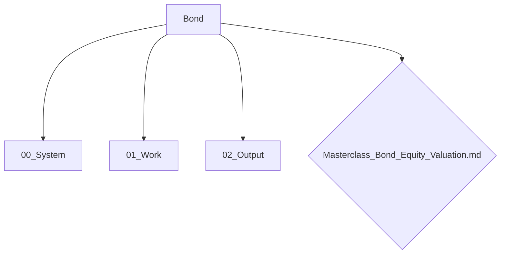

# 🗺 MOSA Topology Report (Local Model)

## 🌐 架構圖 (Mermaid Topology)

```mermaid
graph TD
    Root[Bond] --> Sys[00_System]
    Root --> Work[01_Work]
    Root --> Out[02_Output]
    Root --> Core{Masterclass_Bond_Equity_Valuation.md}
```

## 🧠 上帝視角分析 (God Nodes Insight)
架構極其乾淨，單一核心 God Node 就是 `Masterclass_Bond_Equity_Valuation.md`。它主導了所有與債券/股權估值有關的指示與邏輯公式。
